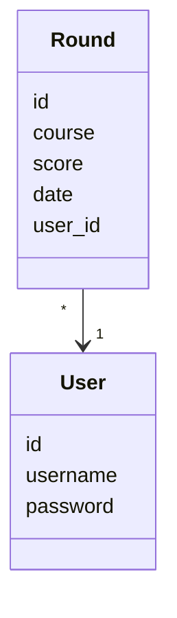
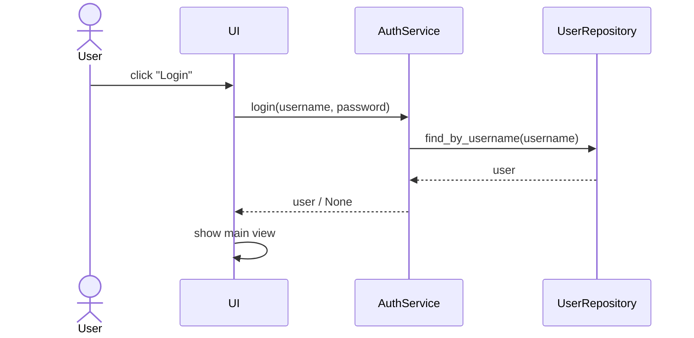
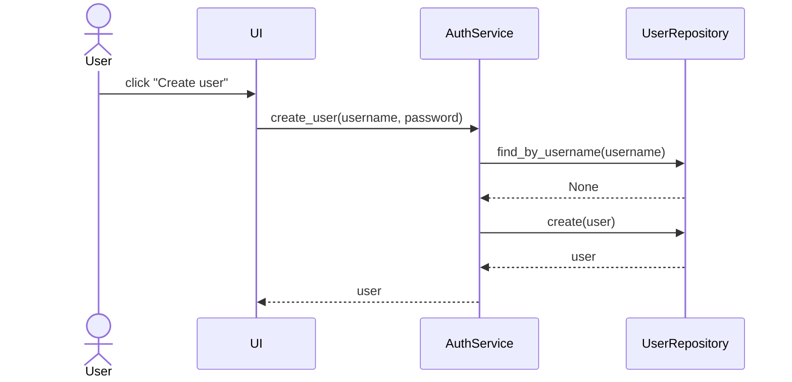
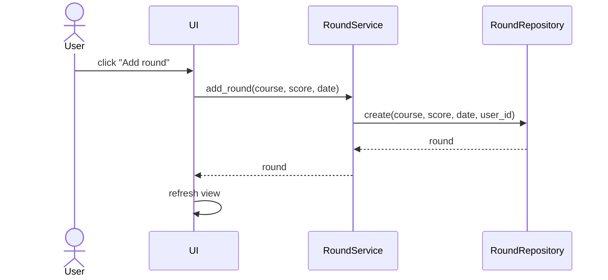
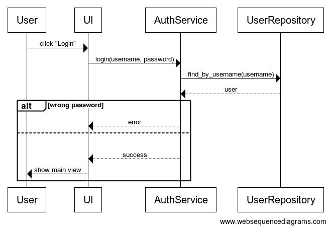
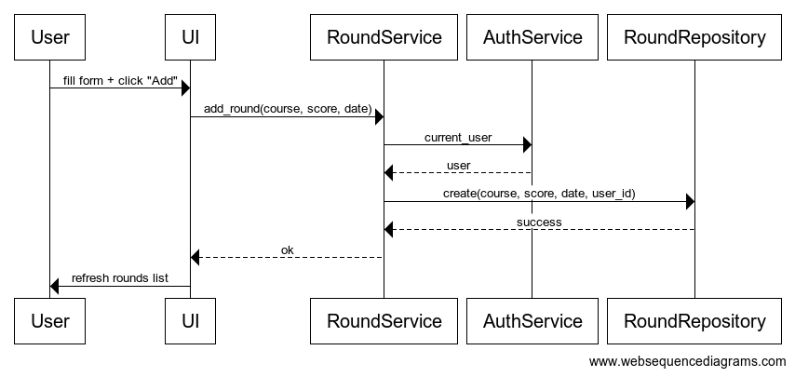

# Arkkitehtuurikuvaus

## Rakenne

Sovellus noudattaa kolmitasoista kerrosarkkitehtuuria, ja koodin pakkausrakenne on seuraava:

* *ui* – käyttöliittymä
* *services* – sovelluslogiikka
* *repositories* – tietojen pysyväistallennus
* *domain* – sovelluksen tietomallit (oliot)

Käyttöliittymä on erotettu sovelluslogiikasta, eikä se käsittele suoraan tietokantaa. Kaikki tieto kulkee *services*-kerroksen kautta.

---

## Käyttöliittymä

Käyttöliittymä on toteutettu Tkinterillä ja koostuu useista näkymistä:

* Kirjautumisnäkymä
* Uuden käyttäjän luontinäkymä
* Kierrosten lisäysnäkymä
* Tilastonäkymä (jos käytössä)

Jokainen näkymä on toteutettu omana luokkanaan. Vain yksi näkymä on kerrallaan näkyvissä.

Näkymät eivät sisällä sovelluslogiikkaa, vaan ne kutsuvat *services*-kerroksen metodeja. Esimerkiksi:

* kirjautuminen → `AuthService.login`
* käyttäjän luonti → `AuthService.create_user`
* kierroksen lisäys → `RoundService.add_round`

Kun data muuttuu (esim. uusi kierros lisätään), käyttöliittymä päivittää näkymänsä hakemalla ajantasaisen datan service-kerrokselta.

---

## Sovelluslogiikka

Sovelluksen loogisen tietomallin muodostavat luokat:

* `User`
* `Round`

Niiden välinen suhde:

Sovelluslogiikasta vastaavat palveluluokat:

### AuthService

Vastaa käyttäjähallinnasta:

* `login(username, password)`
* `create_user(username, password)`
* `logout()`

Luokka ylläpitää myös tietoa kirjautuneesta käyttäjästä (`current_user`).

---

### RoundService

Vastaa golf-kierroksiin liittyvästä logiikasta:

* `add_round(course, score, date)`
* `get_rounds_by_user()`
* `delete_round(round_id)` (jos toteutettu)

RoundService käyttää AuthServicea saadakseen nykyisen käyttäjän.

---

### Riippuvuudet

Service-luokat käyttävät repositoryja, jotka injektoidaan konstruktorissa (dependency injection).

---

## Tietojen pysyväistallennus

Tietojen tallennuksesta vastaavat repository-luokat:

* `UserRepository`
* `RoundRepository`

Tallennus tapahtuu SQLite-tietokantaan (`golf.db`).

### UserRepository

Tarjoaa metodit:

* `create(user)`
* `find_by_username(username)`

---

### RoundRepository

Tarjoaa metodit:

* `create(course, score, date, user_id)`
* `get_by_user(user_id)`
* `delete(round_id)` (jos toteutettu)

---

Repositoryt noudattavat Repository-suunnittelumallia, mikä mahdollistaa niiden korvaamisen esimerkiksi testeissä in-memory-toteutuksilla.

---

## Luokka-arkkitehtuuri

---

## Päätoiminnallisuudet

### Käyttäjän kirjautuminen

Kirjautuminen onnistuu, jos käyttäjä löytyy ja salasana täsmää. Tämän jälkeen käyttäjä asetetaan aktiiviseksi (`current_user`).

---

### Uuden käyttäjän luominen

Jos käyttäjänimi ei ole käytössä, uusi käyttäjä luodaan ja kirjataan sisään automaattisesti.

---

### Kierroksen lisääminen

Kierros liitetään kirjautuneeseen käyttäjään (`user_id`).

---

## Sekvenssikaaviot (kuvina)

Kirjautumisen sekvenssikaavio:

Kierroksen lisäämisen sekvenssikaavio:

---
