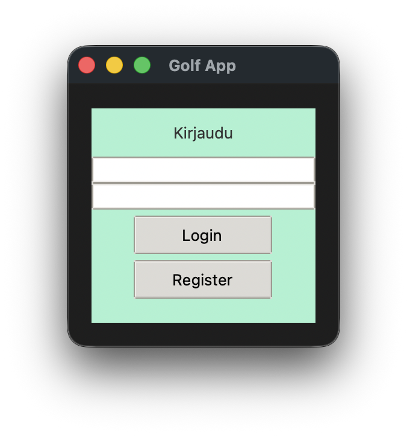
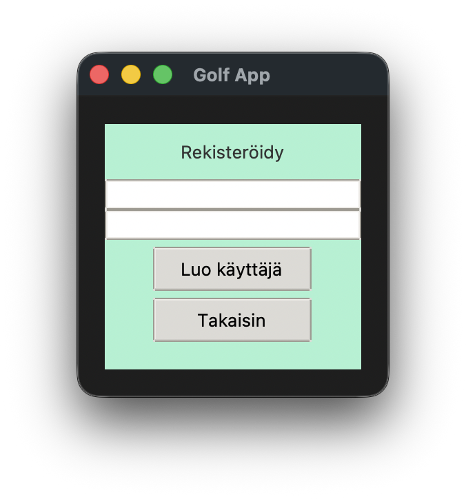
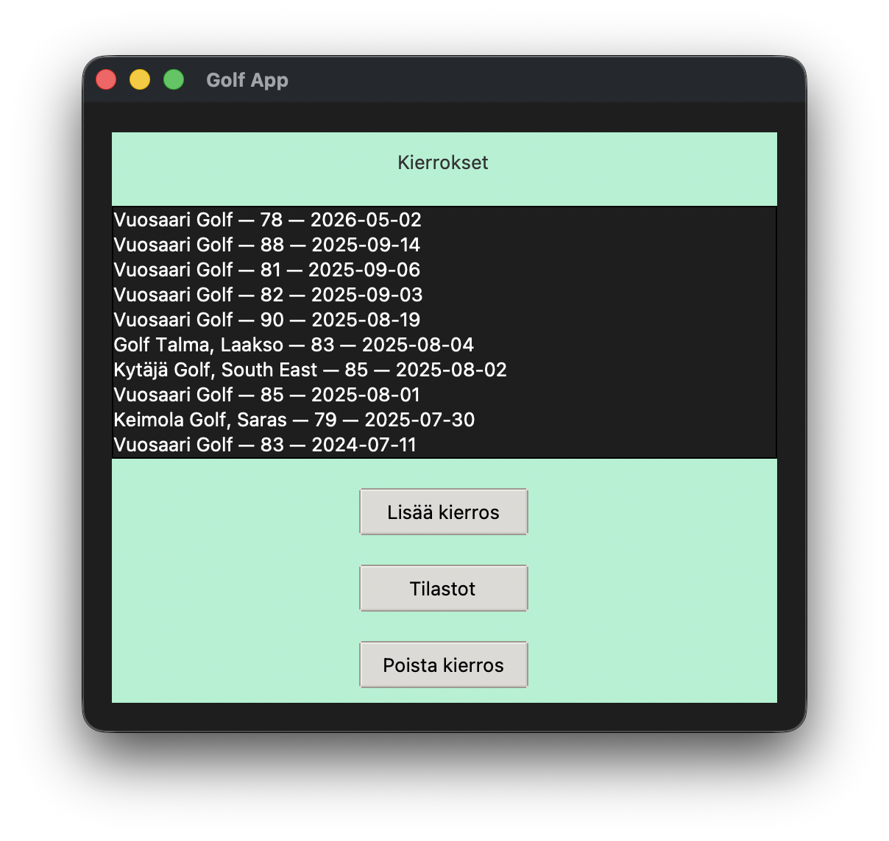
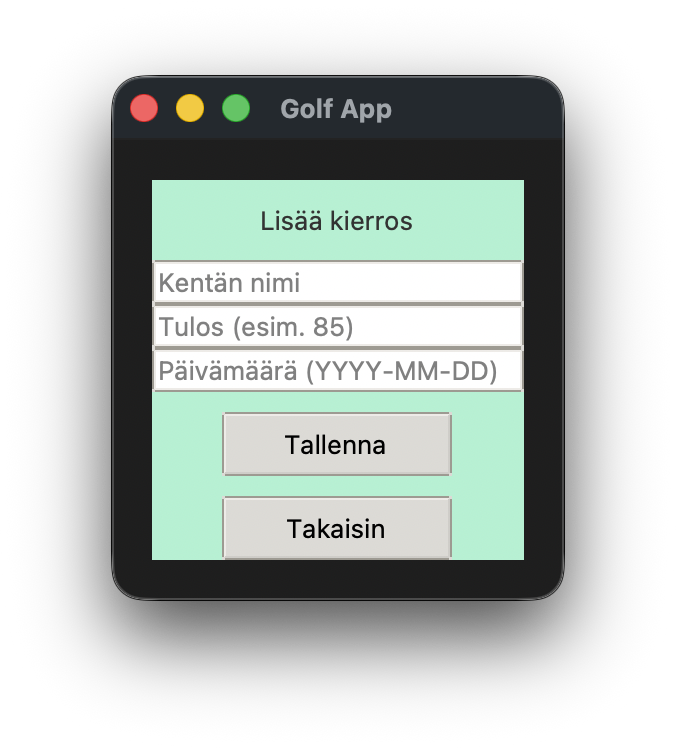
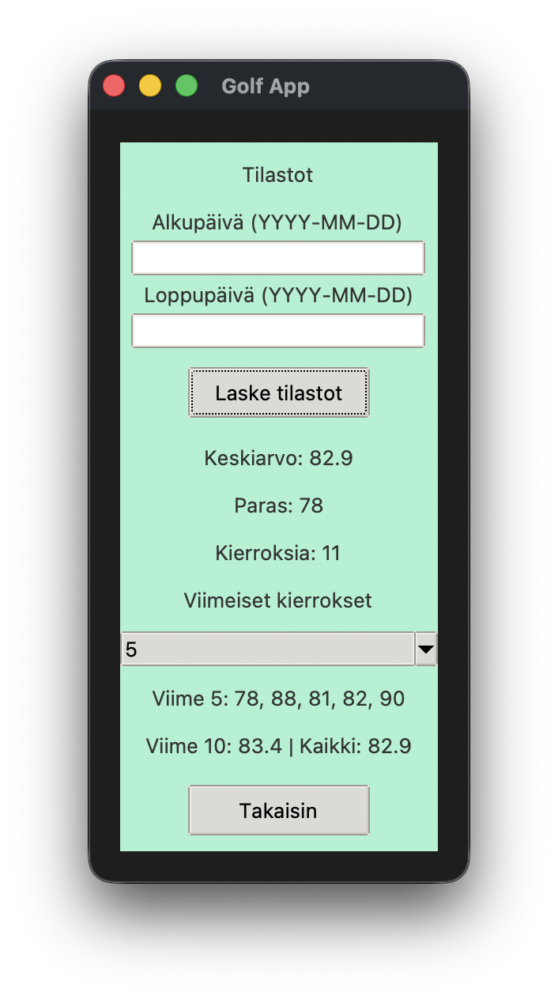

# Käyttöohje

Lataa projektin viimeisimmän [releasen](https://github.com/kaeerola/ot-harjoitusty-/releases) lähdekoodi valitsemalla _Assets_-osion alta _Source code_.

---

## Ohjelman käynnistäminen

Ennen ohjelman käynnistämistä asenna riippuvuudet komennolla:

```bash
poetry install
```

Tämän jälkeen suorita projektin alustustoimenpiteet:

```bash
poetry run invoke build
```

Käynnistä sovellus komennolla:

```bash
poetry run invoke start
```

---

## Kirjautuminen

Sovellus käynnistyy kirjautumisnäkymään:



Kirjautuminen tapahtuu syöttämällä olemassa oleva käyttäjänimi ja salasana ja painamalla painiketta **Login**.

Onnistuneen kirjautumisen jälkeen käyttäjä siirtyy päävalikkoon.

---

## Uuden käyttäjän luominen

Kirjautumisnäkymästä voi siirtyä uuden käyttäjän luontiin painamalla painiketta **Register**.

Rekisteröintinäkymä aukeaa:



Uusi käyttäjä luodaan täyttämällä vaaditut kentät ja painamalla **Luo Käyttäjä**-painiketta.

Onnistuneen luomisen jälkeen käyttäjä kirjataan automaattisesti sisään.

---

## Kierrosten tarkastelu (round_list_view)

Kirjautumisen jälkeen avautuu kierrosten listanäkymä:



Näkymä sisältää listan kierroksista, joista näkyy esimerkiksi:

* kentän nimi
* tulos
* päivämäärä

---

## Kierrosten lisääminen

Painamalla näppäintä **Lisää kierros** aukeaa kierroksen lisäysnäkymä:



Kierros lisätään syöttämällä:

* kentän nimi
* tulos
* päivämäärä

ja painamalla painiketta **Add round**.

Lisätty kierros tallentuu käyttäjän omiin tietoihin.

---

## Kierroksen poistaminen

Kierros poistetaan valitsemalla haluttu kierros näkymästä **Kierrosten tarkastelu** ja painamalla näppäintä **Poista Kierros**.

Valinnan jälkeen kierros poistuu järjestelmästä.

---

## Tilastot

Tilastosivulle pääsee painamalla painiketta **Tilastot**, jolloin aukeaa tilatosivu: 



Tilastosivulla näytetään yhteenveto pelatuista kierroksista, kuten:

* keskimääräinen tulos
* paras kierros
* kierrosten kokonaismäärä

Tilastosivulla voi myöskin rajata huomioon otettavat kierrokset syöttämällä halutut aloitus ja lopetus päivämäärät

---

## Takaisin navigointi

Tilastosivulta ja muista näkymistä voi palata päävalikkoon painamalla painiketta **Takaisin**.
