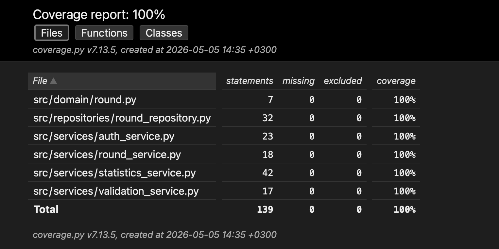

# Testausdokumentti

Ohjelmaa on testattu automatisoiduilla yksikkö- ja integraatiotesteillä `unittest`-kirjastoa käyttäen sekä manuaalisesti suoritetuilla järjestelmätason testeillä.

## Yksikkö- ja integraatiotestaus

### Sovelluslogiikka

Sovelluslogiikasta vastaavia service-luokkia testataan erillisillä testiluokilla. Testeissä service-oliot alustetaan siten, että niiden riippuvuuksiksi injektoidaan valetoteutuksia tai testirepositorioita pysyvän tietokannan sijaan.

Testattavia service-luokkia ovat esimerkiksi:

- `AuthService`
- `RoundService`
- `StatisticsService`
- `ValidationService`

Testeissä varmistetaan muun muassa:

- käyttäjän rekisteröinti ja kirjautuminen
- kierrosten lisääminen ja poistaminen
- käyttäjäkohtaisten kierrosten hakeminen
- tilastojen laskeminen
- syötteiden validointi
- virheellisten syötteiden käsittely

### Repositorio-luokat

Repositorio-luokkia testataan erillisillä testitietokannoilla, jotta testit eivät vaikuta sovelluksen varsinaiseen dataan. Testeissä käytetään SQLite-tietokantaa sekä testikäyttöön tarkoitettuja tiedostoja.

Testattavia repositorio-luokkia ovat esimerkiksi:

- `UserRepository`
- `RoundRepository`

Testeissä varmistetaan muun muassa:

- käyttäjien tallentaminen ja hakeminen
- kierrosten tallentaminen
- kierrosten poistaminen
- käyttäjäkohtaisten kierrosten hakeminen
- tietokantakyselyiden oikea toiminta

### Testauskattavuus

Käyttöliittymäkerrosta lukuun ottamatta sovelluksen testauskattavuus on korkea ja kattaa suurimman osan sovelluslogiikasta sekä tietokantakerroksesta.

Testaamatta jäivät pääasiassa käyttöliittymän visuaaliset komponentit sekä osa virhetilanteista, joita on vaikea simuloida automaattisilla testeillä.

## Järjestelmätestaus

Sovelluksen järjestelmätestaus on suoritettu manuaalisesti.

### Asennus ja konfigurointi

Sovellus on haettu ja sitä on testattu [käyttöohjeen](kayttoohje.md) kuvaamalla tavalla sekä macOS- että Linux-ympäristöissä.

### Toiminnallisuudet

Kaikki vaatimusmäärittelyssä ja käyttöohjeessa kuvatut toiminnallisuudet on käyty läpi manuaalisesti.

Testauksessa tarkistettiin muun muassa:

- käyttäjän rekisteröinti
- kirjautuminen ja uloskirjautuminen
- golfkierroksen lisääminen
- golfkierroksen poistaminen
- kierrosten listaus
- tilastosivun toiminta
- päivämäärä- ja pistemääräsyötteiden validointi

Syötekenttiin on annettu myös virheellisiä syötteitä, kuten:

- tyhjiä kenttiä
- virheellisiä päivämääriä
- negatiivisia tuloksia
- ei-numeerisia arvoja

## Sovellukseen jääneet laatuongelmat

Sovellus ei tällä hetkellä anna täysin selkeitä virheilmoituksia kaikissa poikkeustilanteissa.

Mahdollisia ongelmatilanteita ovat esimerkiksi:

- tietokantatiedostoon ei ole luku- tai kirjoitusoikeuksia
- SQLite-tietokantaa ei ole alustettu ennen sovelluksen käynnistämistä
- tietokantayhteyden epäonnistuminen
- virheellinen `.env`-konfiguraatio
